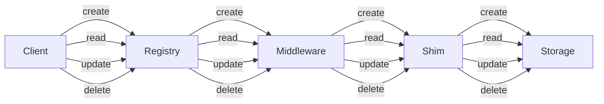

# Architecture

The middleware chain processes each request in order, adding cross-cutting behavior before invoking the business handler.

The entity lifecycle routes CRUD operations through Hypernate components before data reaches persistent storage.

